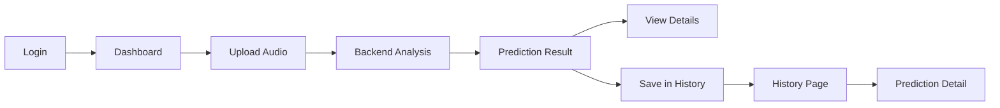
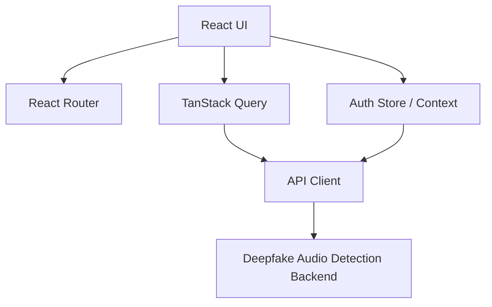
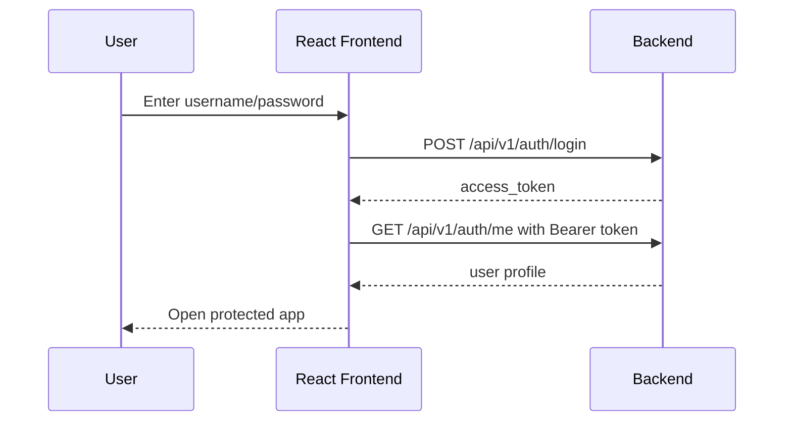
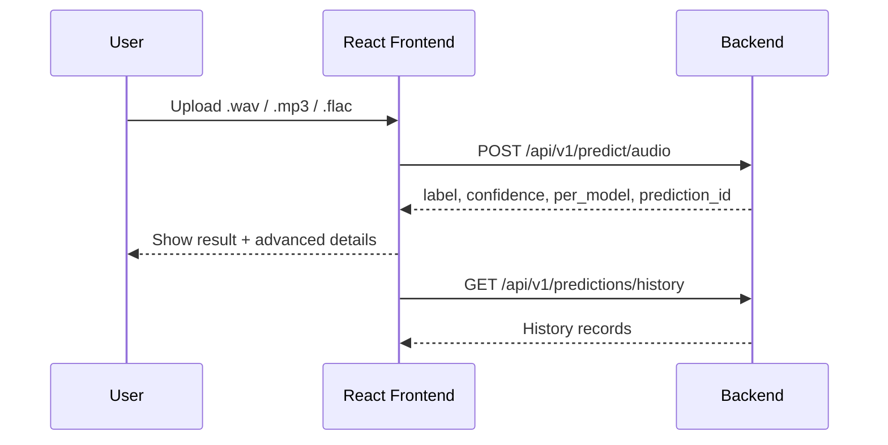

# Detailed Frontend Development Report for the [Deepfake Audio Detection Backend](https://www.genspark.ai/api/files/s/UXtSZhcZ)

## Executive Summary

The backend already defines a clear product shape for the frontend: authenticated users log in, upload an audio file, receive a `real` or `fake` prediction with confidence and per-model details, and review past predictions later. Because the API also exposes health status, request timing, request IDs, and structured error codes, the frontend should be built as a reliable analysis dashboard rather than just a basic upload form. [Source](https://www.genspark.ai/api/files/s/UXtSZhcZ)

The recommended frontend stack is [React](https://react.dev/) with [Vite](https://vite.dev/) for tooling, [React Router](https://reactrouter.com/) for navigation, and [TanStack Query](https://tanstack.com/query/v5/docs/framework/react/overview) for API data fetching and caching. This stack fits especially well because the backend has authenticated routes, upload-driven workflows, and server-owned state such as prediction history and user profile. [React](https://react.dev/) [Vite](https://vite.dev/) [React Router](https://reactrouter.com/) [TanStack Query](https://tanstack.com/query/v5/docs/framework/react/overview)

---

## 1. Product Goals the Frontend Should Support

The backend implies four primary user goals: sign in securely, submit an audio file for analysis, inspect the result in a user-friendly and trustworthy way, and review previous analyses. A fifth secondary goal is transparency: because the backend returns `winning_model`, `models_ran`, `per_model`, `processing_time_ms`, `X-Request-ID`, and `X-Process-Time-Ms`, the frontend can expose both a simple summary and an advanced technical view. [Source](https://www.genspark.ai/api/files/s/UXtSZhcZ)

That means the frontend should be designed as a two-layer experience. The first layer is simple and trust-building: upload audio, get verdict, understand confidence. The second layer is technical and inspectable: model-by-model breakdown, latency, trace ID, and prediction history. This is especially important for deepfake detection products, where user trust and explainability matter. [Source](https://www.genspark.ai/api/files/s/UXtSZhcZ)

---

## 2. Most Important Simple Diagrams

### 2.1 End-to-End User Flow



This is the core product journey implied by the backend endpoints for authentication, prediction, and history. [Source](https://www.genspark.ai/api/files/s/UXtSZhcZ)

### 2.2 Frontend Architecture Diagram



This reflects the recommended React architecture for routing, authenticated access, and server-state management. [Source](https://www.genspark.ai/api/files/s/UXtSZhcZ) [React](https://react.dev/) [React Router](https://reactrouter.com/) [TanStack Query](https://tanstack.com/query/v5/docs/framework/react/overview)

### 2.3 Authentication Flow



The backend explicitly documents JWT-based login and profile retrieval through bearer-token authentication. [Source](https://www.genspark.ai/api/files/s/UXtSZhcZ)

### 2.4 Prediction Flow



This follows the backend prediction endpoint and history endpoint contract. [Source](https://www.genspark.ai/api/files/s/UXtSZhcZ)

---

## 3. Recommended React Frontend Architecture

A clean architecture for this product is a dashboard-style single-page application with route-based pages, a centralized API client, feature-based folders, and server-state handling through [TanStack Query](https://tanstack.com/query/v5/docs/framework/react/overview). [React Router](https://reactrouter.com/) is a strong fit because the app naturally separates into public routes such as login and protected routes such as upload, history, and result detail. [React](https://react.dev/) [React Router](https://reactrouter.com/) [TanStack Query](https://tanstack.com/query/v5/docs/framework/react/overview)

### Suggested Stack

| Layer | Recommendation | Why it fits this project |
|---|---|---|
| UI framework | React | Component-driven UI for upload, charts, auth, and history |
| Build tool | Vite | Fast local development and simple production build |
| Routing | React Router | Clean public/protected route separation |
| Server state | TanStack Query | Ideal for profile fetches, history, and upload mutations |
| HTTP client | Axios or Fetch wrapper | Easy auth header injection and error normalization |
| Forms | React Hook Form + Zod or custom validation | Useful for login and upload validation |
| Styling | Tailwind CSS or MUI | Fast dashboard development |
| Charts | Recharts or Chart.js | Useful for probabilities and per-model output |
| Notifications | Sonner / React Toastify | Clear feedback for upload and auth errors |

The need for routing, authenticated pages, upload mutations, and server-driven state comes directly from the backend design. [Source](https://www.genspark.ai/api/files/s/UXtSZhcZ)

---

## 4. Frontend Information Architecture

The backend strongly suggests the following page structure.

| Route | Purpose | Priority |
|---|---|---|
| `/login` | Username/password login and token acquisition | Must-have |
| `/dashboard` | Main authenticated landing page with quick stats and upload entry | Must-have |
| `/predict` | Dedicated audio upload and analysis workflow | Must-have |
| `/predictions` | Prediction history list | Must-have |
| `/predictions/:id` | Detail page for one prediction | Must-have |
| `/profile` | Current user info from `/api/v1/auth/me` | Nice-to-have |
| `/system-status` | Health and model readiness page | Nice-to-have |

These routes are directly supported by the documented endpoints: login, current user, prediction upload, history, prediction detail, and health check. [Source](https://www.genspark.ai/api/files/s/UXtSZhcZ)

A sidebar or top navigation should include Dashboard, New Analysis, History, and Profile. If the product will be used operationally, add a health badge in the header that checks `/api/v1/health` and signals whether the service is healthy or degraded. Since all 8 models load at startup and the backend can return `MODELS_UNAVAILABLE`, this will help users understand downtime clearly. [Source](https://www.genspark.ai/api/files/s/UXtSZhcZ)

---

## 5. Core User Journeys

### 5.1 Login Journey

The login flow is straightforward: collect `username` and `password`, submit to the auth endpoint, receive a JWT token, store session state, then fetch `/api/v1/auth/me` to populate the authenticated shell. Since the token has a 24-hour expiry and no refresh endpoint is documented, the frontend should be ready to redirect users to login when a 401 occurs. [Source](https://www.genspark.ai/api/files/s/UXtSZhcZ)

### 5.2 Audio Analysis Journey

The main workflow should feel linear and confidence-building: choose a file, validate extension and size client-side, upload using multipart form data, show loading state, then render a result summary with verdict, confidence, probability bars, processing time, winning model, and filename. Since the backend standardizes audio to exactly 5 seconds internally, the frontend does not need to trim audio. [Source](https://www.genspark.ai/api/files/s/UXtSZhcZ)

### 5.3 Result Inspection Journey

After a successful prediction, the first screen should show the high-level verdict prominently: `real` or `fake`, confidence percentage, and a short explanation such as “Most-confident model determined the final outcome.” Below that, an expandable advanced section should show `winning_model`, `models_ran`, `per_model`, `processing_time_ms`, and `prediction_id`. [Source](https://www.genspark.ai/api/files/s/UXtSZhcZ)

### 5.4 History and Traceability Journey

The history page should show filename, verdict, confidence, winning model, created date, and processing time. Clicking a row should open the detail page for that `prediction_id`. The backend database schema and API structure clearly support this. [Source](https://www.genspark.ai/api/files/s/UXtSZhcZ)

---

## 6. API Integration Plan

### 6.1 Authentication and Session

| Feature | Endpoint | Frontend action |
|---|---|---|
| Login | `POST /api/v1/auth/login` | Submit credentials and receive token |
| Current user | `GET /api/v1/auth/me` | Hydrate authenticated user shell |
| Logout | No backend endpoint listed | Clear local session and redirect |

The backend uses JWT bearer authentication with a 24-hour expiry. Every protected request should send `Authorization: Bearer <token>`. This should be centralized in the API client rather than attached manually in each component. [Source](https://www.genspark.ai/api/files/s/UXtSZhcZ)

### 6.2 Prediction Endpoint

| Feature | Endpoint | Request | Response highlights |
|---|---|---|---|
| Predict audio | `POST /api/v1/predict/audio` | `multipart/form-data` with `file` | `label`, `confidence`, `prob_real`, `prob_fake`, `winning_model`, `models_ran`, `per_model`, `processing_time_ms`, `prediction_id`, `filename` |

This is the main frontend integration point. The response supports both a simple verdict UI and a rich technical breakdown UI. [Source](https://www.genspark.ai/api/files/s/UXtSZhcZ)

### 6.3 History and Health Endpoints

| Feature | Endpoint | Frontend use |
|---|---|---|
| Prediction history | `GET /api/v1/predictions/history?limit=20` | Populate history table |
| Prediction detail | `GET /api/v1/predictions/{prediction_id}` | Populate detail page |
| Health | `GET /api/v1/health` | Header badge and status page |

One implementation note: the backend document confirms these endpoints but does not fully show the detail/history response schema. The frontend should therefore use mapping functions and confirm final payload shapes with the backend team. [Source](https://www.genspark.ai/api/files/s/UXtSZhcZ)

---

## 7. UI Modules and Component System

A good React component model for this app should use reusable domain-based components.

| Group | Example components |
|---|---|
| Auth | `LoginForm`, `ProtectedRoute`, `SessionBanner` |
| Upload | `AudioDropzone`, `FileValidationHint`, `UploadButton`, `UploadProgressCard` |
| Results | `PredictionHero`, `ConfidenceMeter`, `ProbabilityBars`, `WinningModelCard`, `PerModelTable`, `ProcessingStats` |
| History | `PredictionHistoryTable`, `PredictionRow`, `HistoryFilters` |
| System | `HealthBadge`, `SystemStatusPanel`, `RequestTraceCard` |
| Shared | `PageHeader`, `Sidebar`, `Loader`, `ErrorState`, `Toast` |

The backend returns clearly separated concerns such as auth, prediction, model breakdown, health, and history, so this component organization is a natural fit. [Source](https://www.genspark.ai/api/files/s/UXtSZhcZ)

A strong result-page layout would have three stacked sections: summary card, probability/model explanation, and advanced diagnostic accordion. That mirrors how users naturally consume AI predictions: outcome first, evidence second, full diagnostics third. [Source](https://www.genspark.ai/api/files/s/UXtSZhcZ)

---

## 8. Recommended Folder Structure

```text
src/
  app/
    router.jsx
    providers.jsx
    queryClient.js
  api/
    client.js
    auth.api.js
    prediction.api.js
    health.api.js
  features/
    auth/
      components/
      hooks/
      pages/
      authStore.js
    prediction/
      components/
      hooks/
      pages/
      prediction.utils.js
    history/
      components/
      hooks/
      pages/
    system/
      components/
      hooks/
  components/
    layout/
    feedback/
    charts/
    forms/
  lib/
    constants.js
    formatters.js
    validators.js
  styles/
  assets/
  main.jsx
```

A feature-first structure is more maintainable than a page-only structure because auth, prediction, history, and health each have their own API and UI concerns. This mirrors the backend route organization well. [Source](https://www.genspark.ai/api/files/s/UXtSZhcZ)

---

## 9. State Management Strategy

The app has two types of state: client state and server state. Session/auth state is client state. Prediction results, history, user profile, and health are server state. That is why [TanStack Query](https://tanstack.com/query/v5/docs/framework/react/overview) is especially useful here. It handles caching, retries, invalidation, loading states, and mutation state for the backend-driven parts of the product. [TanStack Query](https://tanstack.com/query/v5/docs/framework/react/overview)

| State type | Recommended tool |
|---|---|
| Access token and auth status | React Context or lightweight store |
| Current user | TanStack Query |
| Prediction upload | TanStack Query mutation |
| Prediction history | TanStack Query query |
| Health status | TanStack Query polling query |
| Temporary selected file | Local component state |

This split keeps the app simple and aligns with the fact that most important data comes from the backend. [Source](https://www.genspark.ai/api/files/s/UXtSZhcZ)

---

## 10. Upload and Validation Design

The frontend should validate files before upload because the backend only accepts `.wav`, `.mp3`, and `.flac`, and rejects files larger than 20 MB. Client-side validation improves user experience and prevents avoidable API failures. [Source](https://www.genspark.ai/api/files/s/UXtSZhcZ)

| Rule | Frontend behavior |
|---|---|
| Allowed types: `.wav`, `.mp3`, `.flac` | Block unsupported files immediately |
| Max size: 20 MB | Show inline validation error |
| Empty file | Prevent submission |
| Invalid audio | Show server-side error after upload attempt |

The backend also returns structured error codes such as `INVALID_FILE_TYPE`, `FILE_TOO_LARGE`, `EMPTY_FILE`, and `INVALID_AUDIO`, so the frontend should map them to user-friendly messages. [Source](https://www.genspark.ai/api/files/s/UXtSZhcZ)

---

## 11. Error Handling and Resilience

The frontend should implement a formal error-handling strategy because the backend already exposes structured failure modes for file validation, auth failures, inference issues, and model readiness. [Source](https://www.genspark.ai/api/files/s/UXtSZhcZ)

| Backend code/status | Recommended UI behavior |
|---|---|
| `INVALID_FILE_TYPE` | Inline error with accepted formats reminder |
| `FILE_TOO_LARGE` | Inline error with 20 MB size reminder |
| `EMPTY_FILE` | Inline upload error |
| `INVALID_AUDIO` | Inline or toast error explaining decode failure |
| `401 INVALID_TOKEN` | Clear session and redirect to login |
| `403 inactive user` | Block access and show support message |
| `500 INFERENCE_ERROR` | Show retry option and support notice |
| `503 MODELS_UNAVAILABLE` | Disable upload and show system-status warning |

Use route-level error boundaries for major failures and smaller inline error states for forms and tables. Also surface `X-Request-ID` in advanced support views when available. [Source](https://www.genspark.ai/api/files/s/UXtSZhcZ)

---

## 12. Authentication and Security Recommendations

The backend uses JWT bearer authentication and a current-user endpoint, which supports a classic protected-route SPA design. No token means redirect to login. Valid token means render the app shell and fetch the user profile. A 401 response should immediately revoke the session and send the user back to the login page. [Source](https://www.genspark.ai/api/files/s/UXtSZhcZ)

For production hardening, a future improvement would be refresh tokens or cookie-based auth. That is not required for the current frontend, but it is a useful roadmap item for better security and session continuity.

---

## 13. Data Visualization Opportunities

The backend returns rich ML output, especially `prob_real`, `prob_fake`, `winning_model`, `models_ran`, and the `per_model` breakdown. This creates a strong opportunity to make the frontend transparent and visually informative rather than generic. [Source](https://www.genspark.ai/api/files/s/UXtSZhcZ)

| Visualization | Why it matters |
|---|---|
| Verdict badge (`REAL` / `FAKE`) | Immediate readability |
| Confidence meter | Quick trust signal |
| Two-bar probability chart | Clear real-vs-fake comparison |
| Per-model comparison table/chart | Transparency and technical insight |
| Processing-time chip | Operational clarity |
| Health badge | Communicates backend readiness |

A particularly strong UX pattern is to show the simple confidence summary first, then allow users to expand an “Explain this result” section containing the 8-model outputs. [Source](https://www.genspark.ai/api/files/s/UXtSZhcZ)

---

## 14. Performance Considerations

Because inference is CPU-based and all 8 models run on every request, predictions may take noticeable time. The backend explicitly returns `processing_time_ms`, which means latency is a normal part of the product experience and should be designed for. [Source](https://www.genspark.ai/api/files/s/UXtSZhcZ)

The UI should disable duplicate submissions during prediction, show a stable loading card instead of only a spinner, and preserve the result after completion. History and health are good candidates for cached queries, while prediction details can be prefetched from the history view. [Source](https://www.genspark.ai/api/files/s/UXtSZhcZ) [TanStack Query](https://tanstack.com/query/v5/docs/framework/react/overview)

---

## 15. Observability and Support UX

The backend injects `X-Request-ID` and `X-Process-Time-Ms` through middleware and also stores request-related metadata in prediction records. This is valuable for support and debugging workflows, and the frontend should use it. [Source](https://www.genspark.ai/api/files/s/UXtSZhcZ)

A support-friendly prediction detail view should include prediction ID, request ID if available, processing time, and timestamp inside an advanced diagnostic card or “Copy support info” panel.

---

## 16. Testing Strategy for the Frontend

The backend project includes unit, integration, contract, regression, and load testing directories, which suggests a quality-focused engineering approach. The frontend should reflect that same seriousness, especially because it handles authentication, file uploads, and AI-result display. [Source](https://www.genspark.ai/api/files/s/UXtSZhcZ)

| Test type | Scope |
|---|---|
| Unit tests | Validators, formatters, auth helpers, mappers |
| Component tests | Login form, upload dropzone, result cards, history table |
| Integration tests | Login → upload → result flow with mocked API |
| Contract tests | Verify frontend mapping against backend payloads |
| E2E tests | Full user journeys with auth and upload |
| Visual regression | Result cards, charts, and error states |

The most important automated flow is login, valid upload, result render, and history entry visibility. The second most important is the error-handling matrix. [Source](https://www.genspark.ai/api/files/s/UXtSZhcZ)

---

## 17. Delivery Roadmap

### Phase 1: MVP
Build login, protected routes, upload page, result screen, and history list. The backend contract is mature enough for this phase to feel production-ready. [Source](https://www.genspark.ai/api/files/s/UXtSZhcZ)

### Phase 2: Explainability and Trust
Add per-model charts, advanced diagnostics, request-trace visibility, and a stronger result detail page. [Source](https://www.genspark.ai/api/files/s/UXtSZhcZ)

### Phase 3: Operations and Polish
Add health dashboard, retry UX, responsive improvements, accessibility audit, and support-oriented diagnostics. [Source](https://www.genspark.ai/api/files/s/UXtSZhcZ)

| Week | Deliverable |
|---|---|
| Week 1 | Project setup, routing, auth shell, API client |
| Week 2 | Login flow and protected routes |
| Week 3 | Upload flow and result summary |
| Week 4 | History page and prediction detail page |
| Week 5 | Health page, advanced diagnostics, polish |
| Week 6 | Testing, fixes, and deployment hardening |

---

## 18. Backend Clarifications Worth Resolving Before Coding

A few implementation details should be confirmed with the backend team before final frontend development: the exact response schema for `GET /api/v1/predictions/{prediction_id}`, whether history supports pagination beyond `limit`, whether results are sorted newest-first, and whether history supports filters such as label or date. The document confirms these endpoints exist, but not every response shape is shown in full detail. [Source](https://www.genspark.ai/api/files/s/UXtSZhcZ)

It is also worth confirming CORS behavior, whether Nginx will serve the React build from the same domain in production, and whether refresh tokens or cookie-based auth are planned later.

---

## 19. Final Recommendation

This frontend should be built as a professional authenticated analysis dashboard, not as a simple upload widget. The backend already provides the necessary ingredients: secure auth flow, structured prediction responses, prediction history, health status, timing metadata, and model-level transparency. A React SPA built with Vite, React Router, TanStack Query, robust upload UX, and a transparent result-detail experience will align very well with the backend architecture. [Source](https://www.genspark.ai/api/files/s/UXtSZhcZ) [React](https://react.dev/) [Vite](https://vite.dev/) [React Router](https://reactrouter.com/) [TanStack Query](https://tanstack.com/query/v5/docs/framework/react/overview)
